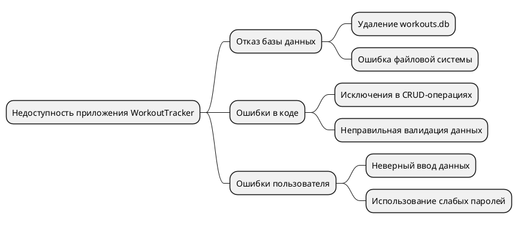

# Анализ рисков WorkoutTracker

## Технические риски
- **Отказ базы данных SQLite**:
  - Потеря доступа к `workouts.db` может привести к недоступности приложения.
  - **Меры**: Регулярные резервные копии, проверка целостности базы перед запуском.
- **Уязвимости в безопасности**:
  - Слабые пароли (например, `admin`/`123`) или отсутствие шифрования данных могут привести к несанкционированному доступу.
  - **Меры**: Смена пароля администратора, внедрение хеширования паролей, ограничение прав доступа.
- **Недостаточное логирование и обработка ошибок**:
  - Отсутствие логов затрудняет диагностику сбоев.
  - **Меры**: Добавить логирование через `Serilog` или встроенные средства .NET.
- **Ошибки миграций базы данных**:
  - Неправильные изменения схемы в Entity Framework Core могут повредить данные.
  - **Меры**: Использовать миграции EF Core с возможностью отката, тестировать на копии базы.

## Человеческие риски
- **Ошибки разработчика**:
  - Неправильный код или настройки могут вызвать сбои в CRUD-операциях.
  - **Меры**: Код-ревью, unit-тесты, использование статического анализа (например, Roslyn).
- **Недостаточная подготовка пользователей**:
  - Неправильное использование интерфейса может привести к ошибкам в данных.
  - **Меры**: Проведение обучения, предоставление документации.

## SWOT-анализ

**S (Сильные стороны)**  
- Простая архитектура на Windows Forms и SQLite, легко устанавливается.  
- Entity Framework Core упрощает работу с базой.  
- Наглядный интерфейс для пользователей и тестов.  

**W (Слабые стороны)**  
- Ограниченное тестирование (только базовые тесты в `Workout_Tracker_Tests`).  
- Отсутствие логирования ошибок.  
- Нет автоматизации сборки и деплоя (CI/CD).  

**O (Возможности)**  
- Интеграция с облачными сервисами для резервного копирования.  
- Добавление unit-тестов через NUnit/xUnit.  
- Автоматизация сборки через GitHub Actions.  

**T (Угрозы)**  
- Уязвимости безопасности (например, отсутствие хеширования паролей).  
- Человеческий фактор при управлении данными.  
- Потеря данных из-за сбоя SQLite или удаления `workouts.db`.  

## FMEA-анализ

| Компонент            | Потенциальный отказ              | Причина                             | Последствия                     | Меры минимизации                          |
|----------------------|----------------------------------|-------------------------------------|---------------------------------|-------------------------------------------|
| База данных SQLite   | Потеря соединения или данных     | Сбой файловой системы, удаление файла | Приложение не запускается       | Резервное копирование, проверка целостности |
| Авторизация          | Несанкционированный доступ       | Слабые пароли, отсутствие шифрования | Утечка данных                   | Хеширование паролей, смена дефолтных учёток |
| Формы Windows Forms  | Исключения при вводе данных      | Отсутствие валидации                | Ошибки приложения, неверные данные | Валидация ввода, обработка исключений     |
| Миграции EF Core     | Повреждение схемы данных         | Ошибка в миграции                   | Потеря или искажение данных     | Тестирование миграций, бэкапы перед обновлением |

## FTA-анализ

### Меры предотвращения
- Централизованная обработка исключений в Windows Forms.  
- Валидация данных на уровне форм и моделей.  
- Регулярные резервные копии `workouts.db`.  
- Обучение пользователей и смена дефолтных паролей.